---
## Author
author:
  name: Ванюшкина Татьяна Валерьевна
  degrees: DSc
  orcid: 0000-0002-0877-7063
  email: 1132246713@rudn.ru
  affiliation:
    - name: Российский университет дружбы народов
      country: Российская Федерация
      postal-code: 117198
      city: Москва
      address: ул. Миклухо-Маклая, д. 6

## Title
title: "Отчет по выполнению внешнего курса"
subtitle: "Основы кибербезопасности"
license: "CC BY"
---

# Цель работы

Получить основы кибербезопасности: 
- узнать как обеспечить безопасность функционирования в сети
- узнать как защитить свой ПК/телефон
- получить навыки криптографии на практике

# Задание

Пройти внешний курс https://stepik.org/course/111512 

# Теоретическое введение

Кибербезопасность — это защита цифровых систем, сетей, программ и данных от атак, кражи или повреждения. Она обеспечивает конфиденциальность, целостность и доступность информации. Включает использование антивирусов, шифрования, безопасных паролей и обучение персонала для предотвращения киберугроз, таких как фишинг и вредоносное ПО.

# Выполнение лабораторной работы

1. Поступаем на курс и ознакамливаемся с входными материалами

([рис.1 @fig-001]).
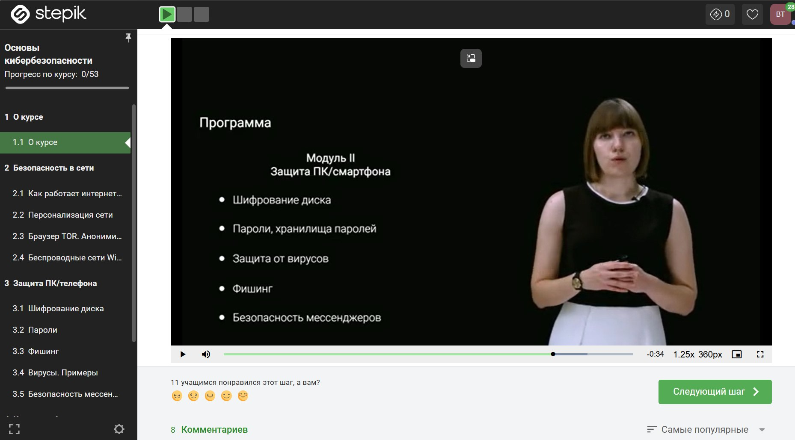{#fig-001 width=70%}

2. Приступаем к первому модулю "Безопасность в сети" 

Проходим первые задания на тему "Как работает интернет:базовые протоколы"
([рис.2 @fig-002]).
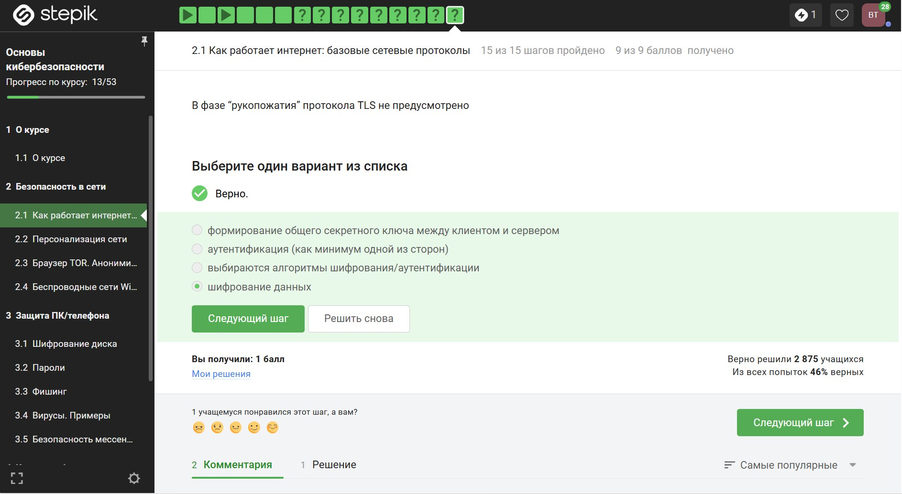{#fig-002 width=70%}

Дплее выполняем задания связанные с персонализацией в сети 

([рис.3 @fig-003]).
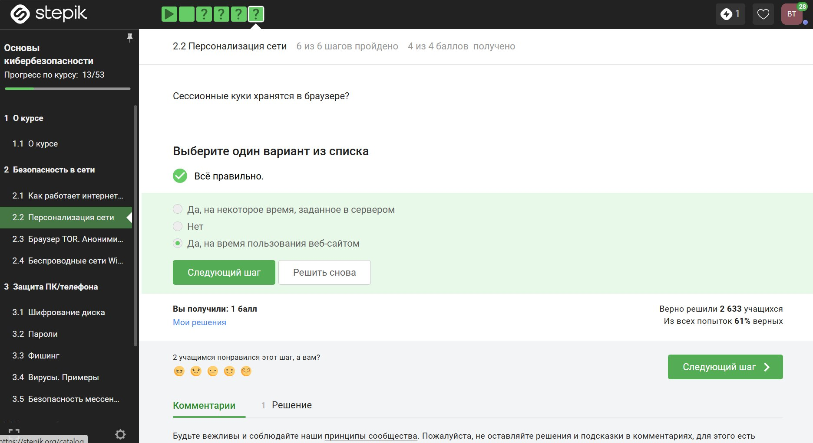{#fig-003 width=70%}

Далее знакомимся с браузером TOR и анонимизацией

([рис.4 @fig-004]).
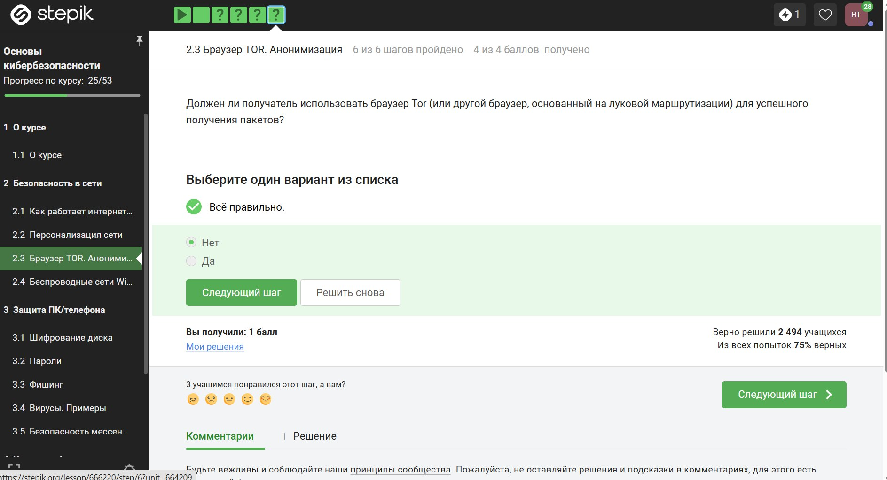{#fig-004 width=70%}

Затем переходим к беспроводным сетям Wi-fi

([рис.5 @fig-005]).
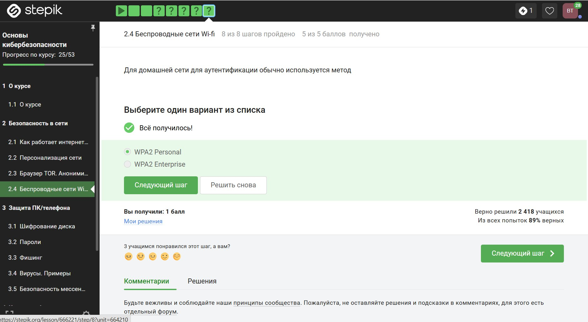{#fig-005 width=70%}

3. Защита ПК/телефона

Выполняем задания на тему "Шифрование диска". В этом пункте мы узнаем как шифруются носители 

([рис.6 @fig-006]).
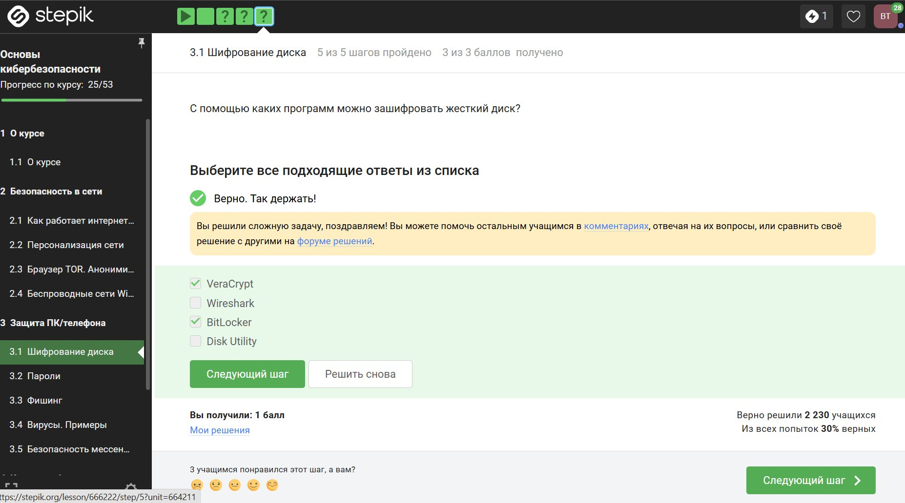{#fig-006 width=70%}

Следующий пункт "Пароли". Здесь учимся обеспечивать наденость паролей и где их парвильно хранить

([рис.7 @fig-007]).
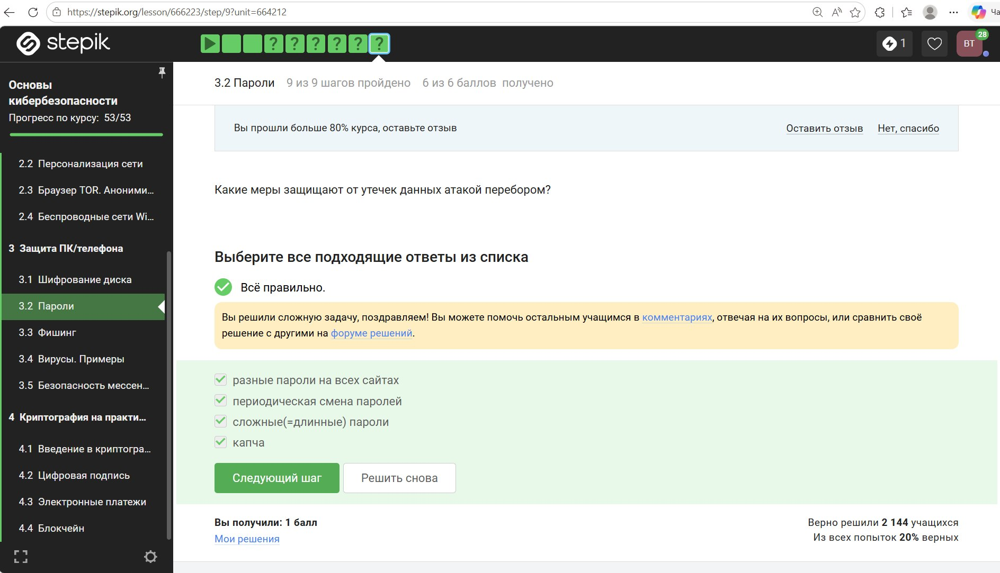{#fig-007 width=70%}

"Фишинг". Рассматриваем, какие типы фишинговых рассылок бывают и как их можно избежать. 

([рис.8 @fig-008]).
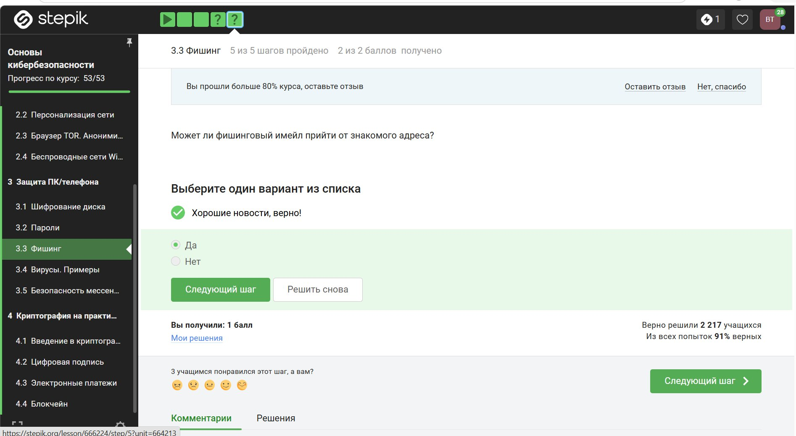{#fig-008 width=70%}

"Вирусы". Узнаем какие бывают вирусы и какой вред они могут наносить

([рис.9 @fig-009]).
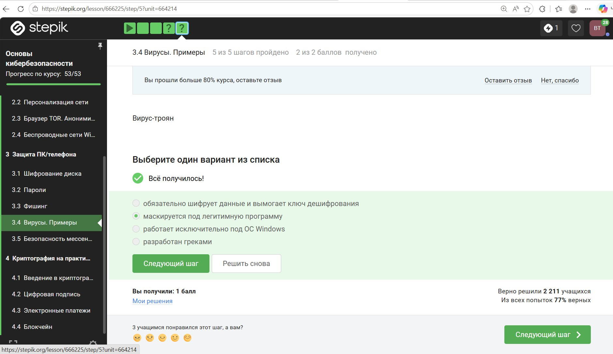{#fig-009 width=70%}

Последний пункт модуля - "Безопасность мессенджеров". Узнаем как достигается безопасность сообщений в современных мессенджерах

([рис.10 @fig-010]).
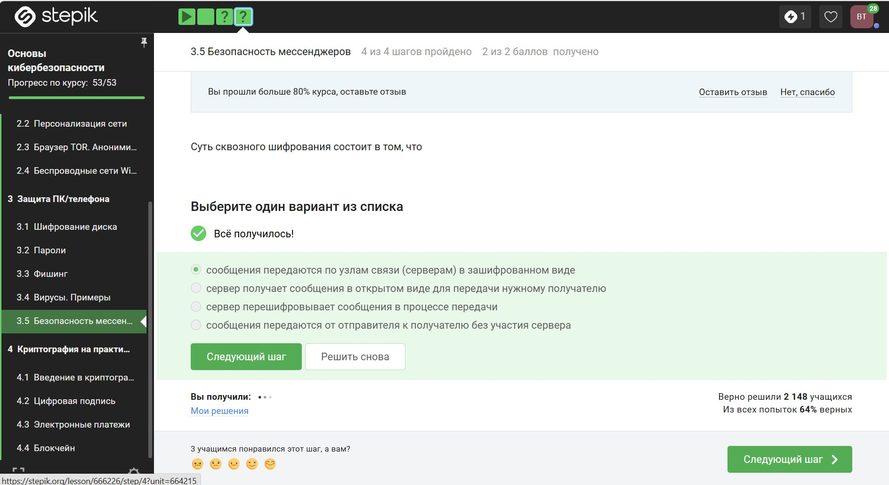{#fig-010 width=70%}

4. Криптография на практике 

"Введение в криптографию". Узнаем какие бывают виды криптографии и как это применять 
([рис.11 @fig-011]).
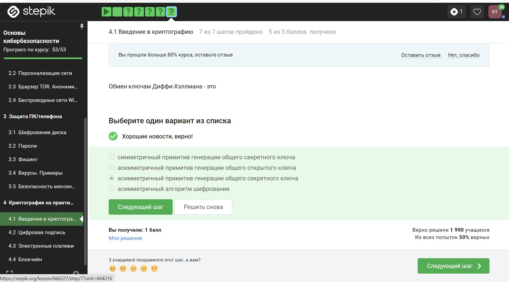{#fig-011 width=70%}

"Цифровая подпись". Здесь мы знакомимся с применением  электронно-цифровой подписи

([рис.12 @fig-012]).
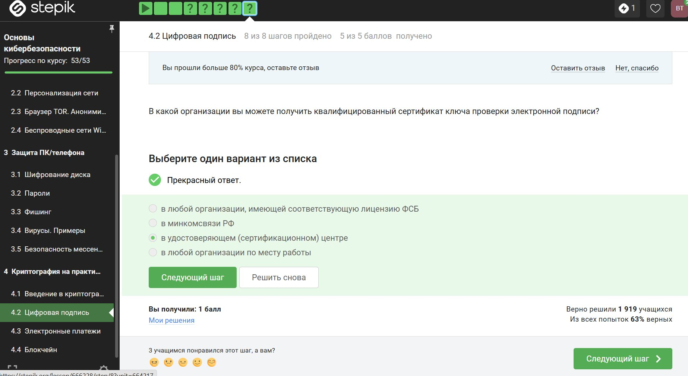{#fig-012 width=70%}

"Электронные платежи". Узнаем как работают электронные платежи 

([рис.13 @fig-013]).
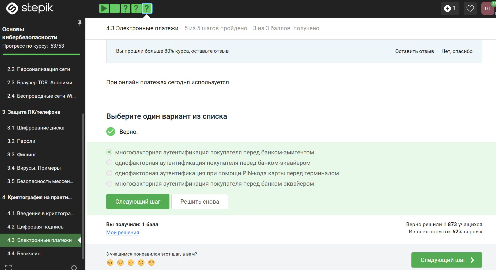{#fig-013 width=70%}

"Блокчейн". Разбираем систему блокчейн

([рис.14 @fig-014]).
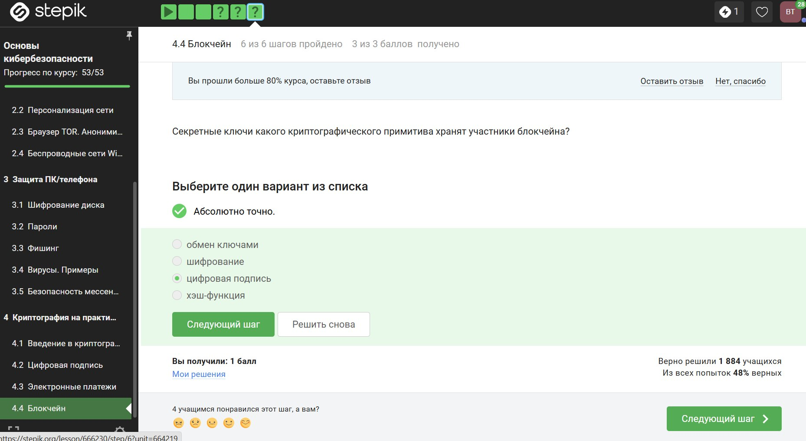{#fig-014 width=70%}

На этом завершаем прохождение курса

([рис.15 @fig-015]).
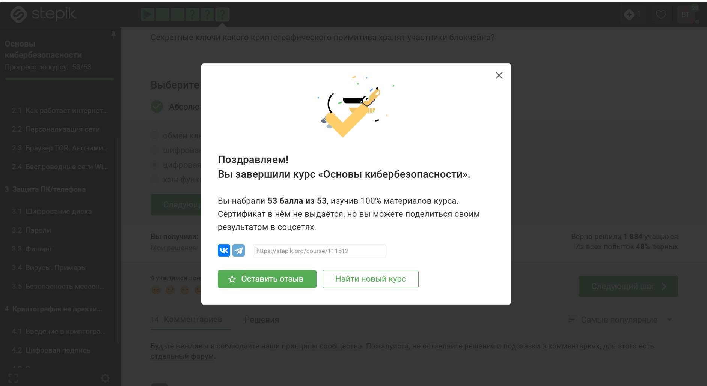{#fig-015 width=70%}

# Выводы

Я прошла курс "Основы кибербезопасности", во время прохождения которого я получила навыки обеспечения безопасности в сети, узнала как правильно защитить свои устройства и получила навыки криптографии

# Список литературы{.unnumbered}
::: {#refs}
:::
